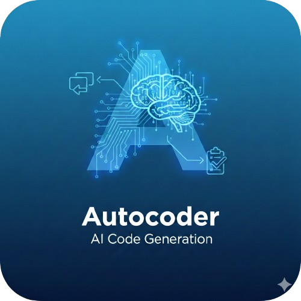
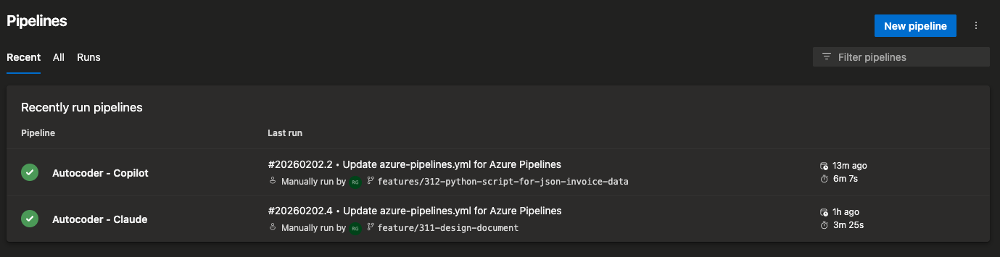
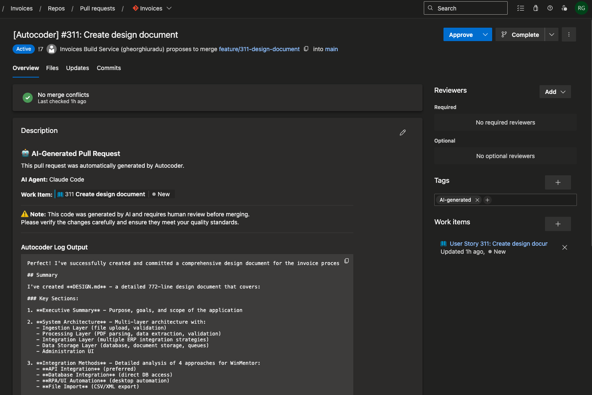
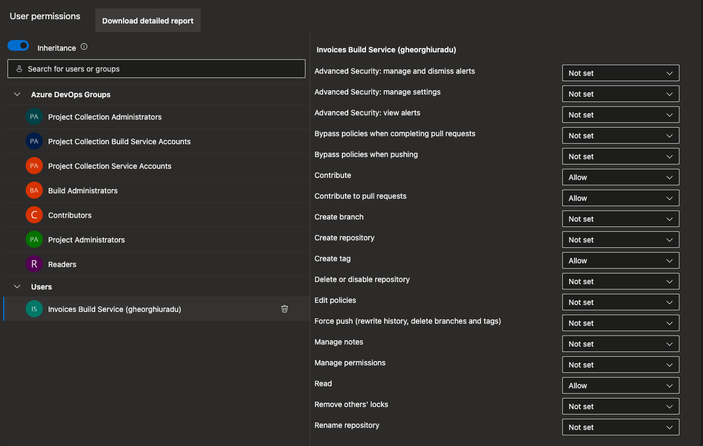
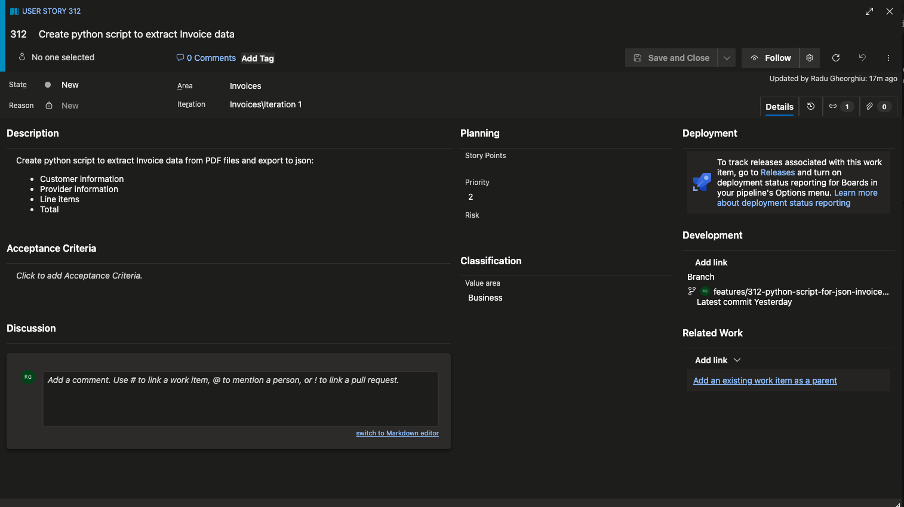
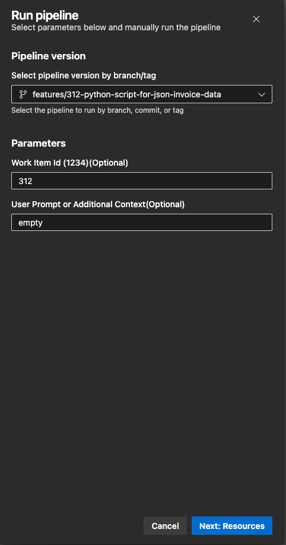
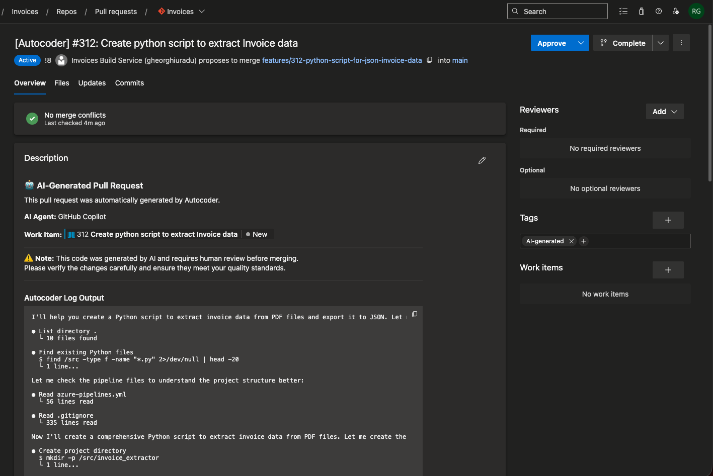

# Autocoder


Run code agents directly from your Azure DevOps pipelines to generate code based on work items or custom prompts and (optionally) create pull requests with the changes.


## Features
- Generate code based on Azure DevOps work items or custom user prompts.
- Support for Github Copilot CLI and Anthropic Claude Code agents.
- Automatic creation of pull requests with the generated code changes.
- Runs in container for isolation and compatibility.
- Configurable system prompts and container images for advanced customization.



## Prerequisites
- An Azure DevOps organization with a repository containing your codebase.
- A Github Copilot Token or Anthropic Console API Key for Claude Code access.
- Repository permissions for the build service identity to create branches and pull requests, or a personal access token (PAT) with appropriate scopes.

## Configuration
1. Install the Autocoder extension from the [Azure DevOps Marketplace](https://marketplace.visualstudio.com/items?itemName=RaduGheorghiu.ado-autocoder).
2. Add a checkout step to your pipeline to ensure the codebase is available. **This is required for the Autocoder task to function correctly.**
2. Add the Autocoder task to your build or release pipeline.
3. Add any necessary variables or secrets to your pipeline for the API keys or tokens.
4. Add an optional, but recommended step to publish the autocoder logs as pipeline artifacts for easier debugging. The logs will be avialable in the '$(Build.ArtifactStagingDirectory)/autocoder.log' file.
5. Configured the required permissions:
- **Contribute**: To create branches and push changes.
- **Contribute to pull requests**: To create and update pull requests with the generated code changes.

6. Save and run your pipeline. The Autocoder task will generate code based on the specified work item or prompt and optionally create a pull request with the changes.

Here is an example of how to use the Autocoder task with Github Copilot in a YAML pipeline:

```yaml
trigger:
- none

pool:
  vmImage: ubuntu-latest

parameters:
  - name: WorkItemId
    displayName: Work Item Id (1234)(Optional)
    type: number
    default: 0

  - name: UserPrompt
    displayName: User Prompt or Additional Context(Optional)
    type: string
    default: empty

  - name: CreatePullRequest
    displayName: Create Pull Reuqest
    type: boolean
    default: true

variables:
  - group: GITHUB

  - name: userPrompt
    ${{ if eq(parameters.UserPrompt, 'empty') }}:
      value: ''
    ${{ else }}:
      value: ${{ parameters.UserPrompt }}

  - name: workItemId
    ${{ if eq(parameters.WorkItemId, 0) }}:
      value: ''
    ${{ else }}:
      value: ${{ parameters.WorkItemId }}

steps:

- checkout: self
  fetchDepth: 0  # Full clone
  persistCredentials: true

- task: Autocoder@1
  inputs:
    workItemId: '$(workItemId)'
    userPrompt: '$(userPrompt)'
    agentType: 'copilot'
    apiKey: '$(GITHUB_PAT)'
    createPullRequest: ${{ parameters.CreatePullRequest }}
    # Optional: specify a model to use
    # model: 'gpt-5.2-codex'

- task: PublishBuildArtifacts@1
  inputs:
    PathtoPublish: '$(Build.ArtifactStagingDirectory)'
    ArtifactName: 'drop'
    publishLocation: 'Container'
  condition: true
```

And here is an example of how to use the Autocoder task with Claude Code in a YAML pipeline:

```yaml
trigger:
- none

pool:
  vmImage: ubuntu-latest

parameters:
  - name: WorkItemId
    displayName: Work Item Id (1234)(Optional)
    type: number
    default: 0

  - name: UserPrompt
    displayName: User Prompt or Additional Context(Optional)
    type: string
    default: empty

  - name: CreatePullRequest
    displayName: Create Pull Reuqest
    type: boolean
    default: true

variables:
  - group: ANTHROPIC

  - name: userPrompt
    ${{ if eq(parameters.UserPrompt, 'empty') }}:
      value: ''
    ${{ else }}:
      value: ${{ parameters.UserPrompt }}

  - name: workItemId
    ${{ if eq(parameters.WorkItemId, 0) }}:
      value: ''
    ${{ else }}:
      value: ${{ parameters.WorkItemId }}

steps:

- checkout: self
  fetchDepth: 0  # Full clone
  persistCredentials: true

- task: Autocoder@1
  inputs:
    workItemId: '$(workItemId)'
    userPrompt: '$(userPrompt)'
    agentType: 'claude'
    apiKey: '$(ANTHROPIC_API_KEY)'
    createPullRequest: ${{ parameters.CreatePullRequest }}
    # Optional: specify a model to use
    # model: 'claude-3-5-sonnet-20241022'

- task: PublishBuildArtifacts@1
  inputs:
    PathtoPublish: '$(Build.ArtifactStagingDirectory)'
    ArtifactName: 'drop'
    publishLocation: 'Container'
  condition: true
```
## Example
For the following work item:


When running the example pipeline, the input should look like this:


And the resulting pull request should look like this:


## Task parameters

| Parameter    | Description                                 | Required | Example |
|-------------|---------------------------------------------|----------|---------|
| Work Item ID | The ID of the work item to generate code for. | No       | 1234    |
| User Prompt  | A custom prompt to guide code generation.    | No       | "Implement a function to sort an array." |
| AI Agent tool | The AI agent to use for code generation (copilot, claude). | Yes      | copilot |
| apiKey     | Your API key or token for the selected AI agent. | Yes      | ghp_xxx... |
| containerImage | Custom image override to use | No       | ghcr.io/github-copilot/cli:latest |
| System Prompt Override | Custom system prompt to guide the AI agent's behavior. | No       | "You are a helpful coding assistant." |
| Create Pull Request | Whether to create a pull request with the generated code changes. Defaults to true. | No       | false    |
| Target Branch | The branch to create the pull request against. Defaults to main. | No       | development     |
| Model | The AI model to use (e.g., 'gpt-4o', 'claude-3-5-sonnet-20241022'). If not specified, the default model for the selected agent will be used. | No       | - For copilot: claude-sonnet-4.5, claude-haiku-4.5, claude-opus-4.6, claude-opus-4.6-fast, claude-opus-4.5, claude-sonnet-4, gemini-3-pro-preview, gpt-5.2-codex, gpt-5.2, gpt-5.1-codex-max, gpt-5.1-codex, gpt-5.1, gpt-5, gpt-5.1-codex-mini, gpt-5-mini, gpt-4.1 - For claude code: Provide an alias for the latest model (e.g. 'sonnet' or 'opus') or a model's full name (e.g.'claude-sonnet-4-5-20250929').     |
